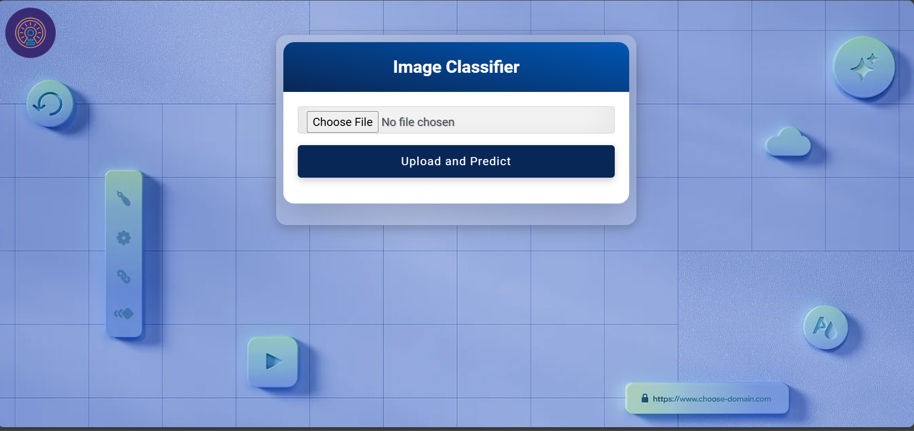
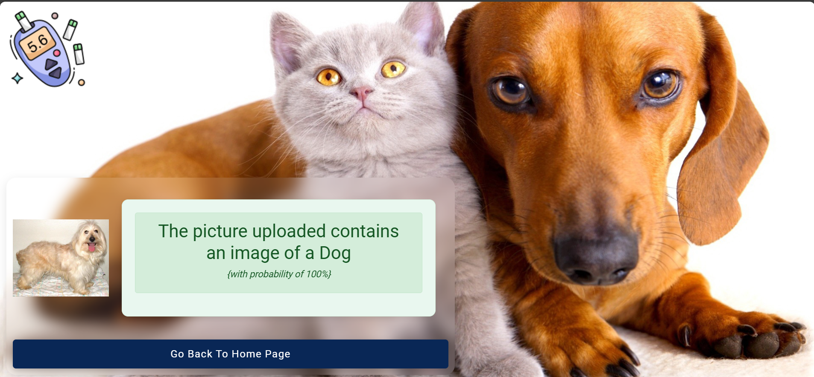

# Dog vs. Cat Image Classifier using CNN

This project demonstrates the development of a Convolutional Neural Network (CNN) model for classifying images as either a dog or cat. CNNs are among the most effective models for image classification tasks due to their ability to capture spatial hierarchies in images, making them well-suited for recognizing and differentiating patterns within image data. The classifier built in this project is trained to analyze an input image and predict the probability of it being a dog or cat, delivering high accuracy on unseen images.

The project utilizes Keras and TensorFlow to build and train the model and provides a user interface for uploading images and receiving predictions. This project is ideal for exploring deep learning principles, image classification techniques, and deploying a model for user interaction.

#### Project Goals
* Model Development: Build and optimize a CNN architecture capable of accurately distinguishing between dog and cat images.
* Image Processing: Preprocess image data to improve the model's generalization ability.
* Model Training and Evaluation: Train the model using labeled images, evaluate its performance, and optimize to achieve high accuracy.
* Deployment Interface: Provide a simple UI for users to upload an image and receive a classification result.

## Key Components of the Project:

#### 1. Data Collection and Preprocessing
* Data Source: The data was sourced from [Microsoft Inc](https://www.microsoft.com/en-us/download/details.aspx?id=54765&msockid=0b279666b41b65002635837fb5b1647b/), which contains thousands of labeled images of dogs and cats. Images were split into training, validation, and testing datasets to allow the model to learn and be tested on unseen data.

#### 2. Data Preprocessing

- Image Resizing: Each image is resized to a uniform shape (224x224 pixels) to ensure consistency for the CNN input layer.
- Normalization: Pixel values are scaled by subtracting mean from the RGB channels to improve model performance.


#### 3.  Model Architecture

The CNN model is designed to progressively capture detailed patterns and features from the image, such as edges, textures, and shapes. The architecture includes:

- Convolutional Layers: To extract spatial features from the images by using filters.
- Pooling Layers: To downsample feature maps, reducing computation and helping prevent overfitting.
- Fully Connected (Dense) Layers: To interpret the high-level features from convolutional layers and make the final prediction.
- Output Layer: Uses a sigmoid activation function to output a probability score for the binary classification (dog or cat)

#### 4. Model Training and Evaluation:


* Loss Function: Categorical Cross-Entropy, as it’s a classification task.
* Optimizer: Adam optimizer is used to optimize weights efficiently.
* Batch Size: Small batch sizes are used to ensure efficient memory utilization.
* Epochs: The model is trained over multiple epochs, with early stopping to prevent overfitting if no improvement is observed in validation accuracy.
* Performance Metrics: Accuracy, precision, recall, F1-score, and AUC-ROC
* Tuning: The pre-trained VGG16 was employed to fine-tune the CNN for optimal performance.

#### 5. Model Deployment:
* Real-Time Classification: The selected model was integrated into a Flask web application, enabling real-time classification of images into either a Cat or Dog.
* User Interface: A user-friendly interface was developed using HTML, CSS, Javascript, allowing users to input relevant data and receive instant predictions.


#### 6. Additional Features:
* Error Handling: The application includes error handling to manage invalid inputs and provide meaningful feedback to users.
* Responsive Design: The interface is designed to be responsive, ensuring compatibility with various devices and screen sizes.
* Uploaded images are backed up in the `static\uploads` folder for future analysis and archival purposes

### Technologies Used:
* Tools: Python, HTML, CSS, Javascript
* Frameworks and Libraries: Flask, Scikit-learn, Tensorflow, Keras, NumPy, Boostrap, JQuery
* Version Control: Git

**Model Development**: Check the [model development](CNN.ipynb) for detailed preprocessing and modelling steps.

## Model Performance


### Convolutional Neural Network


## Performance Metrics Summary
|Accuracy|Precision|Recall|F1 Score
|:-:|:-:|:-:|:-:
|67%|67%|67%|67%|

Due to the results above pointing to the model suffering from overfitting, the model was fine-tuned using the pre-trained `VGG16` Model.

### Fine-Tuned Convolutional Neural Network
Below are the results from the fine-tuned CNN Model


The model can be found in [CNN Model](https://1drv.ms/f/c/68167ae582e5b685/EmC98g4YdUtNkiQkVYeJgQ8B-iEi1goNG39VWyT00M1OgA?e=n0x4Rf)
## Performance Metrics Summary
|Accuracy|Precision|Recall|F1 Score
|:-:|:-:|:-:|:-:
|97%|98%|97%|97%|

## Model Deployment

### Prerequisites

- Python 3.10-3.12
- Pip (Python package installer)
- Jupyter Notebook/Lab

### Setup

1. **Clone the repository:**

    ```sh
    git clone https://github.com/rojuadeyemi/Dog-and-Cat-Classifier.git
    cd Dog-and-Cat-Classifier
    ```

2. **Create a virtual environment:**

Use the provided `Makefile` to create a virtual environment, and install dependencies by running `make` or `make all`.

You can also create a virtual environment manually using the following approaches.

For *Linux/Mac*:

```sh
python -m venv .venv
source .venv/bin/activate 
```

For *Windows*:
    
```sh
python -m venv .venv
.venv\Scripts\activate
```

3. **Install the required dependencies:**

    ```sh
    pip install -U pip
    pip install -r requirements.txt
    ```

### Deploy the Application Locally

A Flask-based web application was developed to deploy the model, providing an interface for users to upload an image and receive a prediction. The user interface accepts image files and returns the model's prediction with a probability score.

To start the *Flask development server* locally, run the command `make develop`. You can also use the following commands:

For *Linux/Mac*:
```sh
export FLASK_APP=app.py
export FLASK_ENV=development
export FLASK_DEBUG=1
flask run   
```
For *Windows*:
```sh
set FLASK_APP=app.py
set FLASK_ENV=development
set FLASK_DEBUG=1
flask run
```

Then open your web browser and navigate to `<http://127.0.0.1:5000/>` to access the aplication.




After uploading an image, then click `Upload and Predict`.



### Deployment Into Production
Use the provided `Procfile` to deploy into production along with the source codes.

### Future Improvements

* Mobile/Edge Deployment: Convert the model to TensorFlow Lite for mobile or edge deployment.
* Multiclass Classification: Extend the project to classify more than two categories of animals.
* Explainability Enhancements: Integrate Grad-CAM or similar techniques for better interpretability of model decisions.

### Conclusion
This project provides a hands-on approach to building, training, and deploying a CNN model for binary image classification. It is a valuable learning resource for understanding CNNs, image data processing, and model deployment on the web. With its flexible structure, this project can be extended for other types of image classification tasks and improved to reach even higher levels of accuracy and efficiency.
